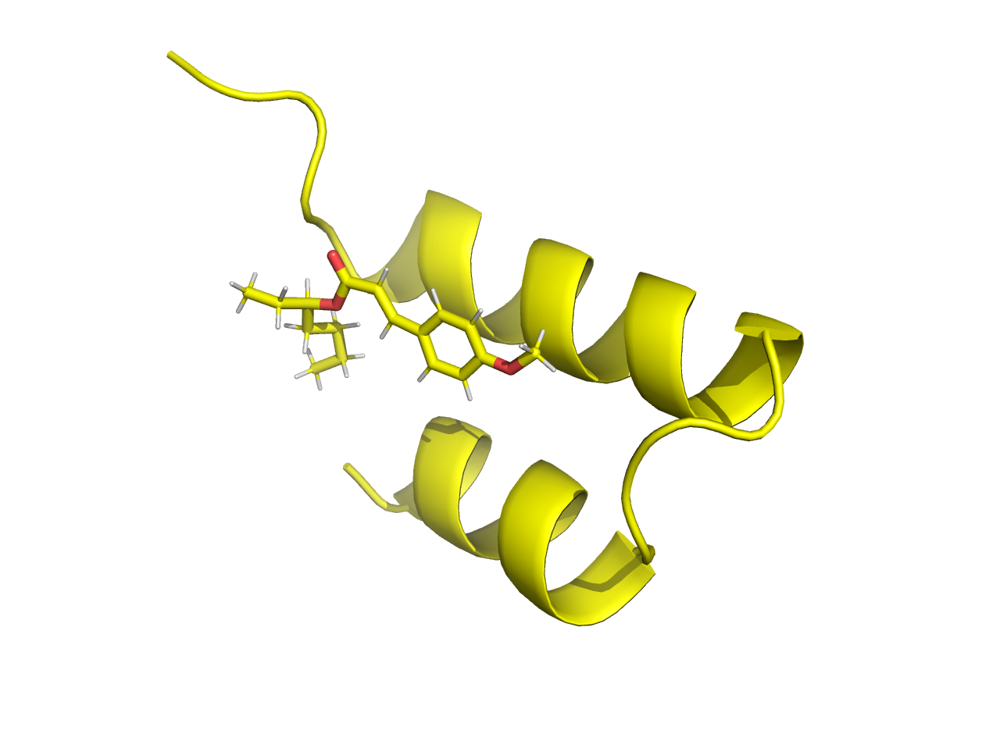
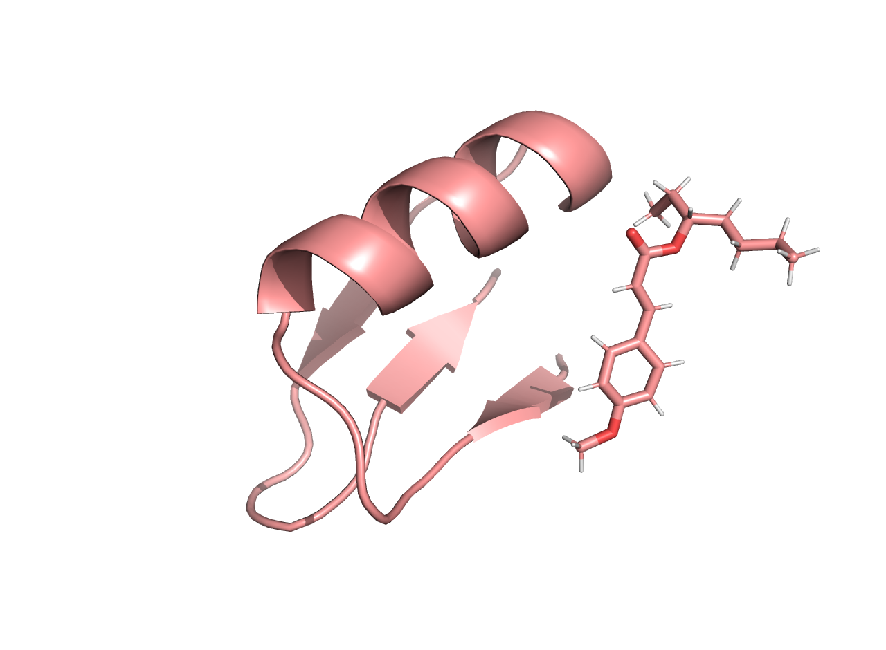

# BoltzGen on Apple silicon

BoltzGen designs binders — proteins, peptides, nanobodies — for a target that can itself be a
protein, a peptide, a nucleic acid or a small molecule. It ships CUDA-only and assumes a CUDA
device exists, so it does not install and does not run on a Mac.

This repository holds the seven-file patch that makes it run, and the results of pointing it at
the problem `peptidebuilder` works on: designing a short peptide that binds a small molecule.
Eight designs were produced, folded, measured with that project's own metrics, and two were taken
through 20 ns of dynamics and MM/GBSA. The headline is that one of those two is the third-strongest
binder measured anywhere in the project and the other is the weakest, and that what separates them
is not what the static screen was built to detect.

**BoltzGen's own source is not copied here.** Get it from upstream and patch it, which is what the
directions below do. The interesting content is 23 lines; a vendored copy of a 63 MB tree under
active development goes stale with the next release.

Verified on macOS 26.5, 8 GB unified memory, Python 3.12, torch 2.14.

---

## Contents

- [Why it does not run, and what was changed](#why-it-does-not-run-and-what-was-changed)
- [Prior art: PR #145](#prior-art-pr-145)
- [Install](#install)
- [Run](#run)
- [Repository layout](#repository-layout)
- [The design specification](#the-design-specification)
- [Worked example: eight peptides for one small molecule](#worked-example-eight-peptides-for-one-small-molecule)
- [How the structured folds hold the ligand](#how-the-structured-folds-hold-the-ligand)
- [Dynamics and MM/GBSA: the verdict on two of them](#dynamics-and-mmgbsa-the-verdict-on-two-of-them)
- [What the physics selects, unprompted](#what-the-physics-selects-unprompted)
- [Scale is the limit, not the hardware](#scale-is-the-limit-not-the-hardware)
- [Traps](#traps)
- [Reusing structures between this and peptidebuilder](#reusing-structures-between-this-and-peptidebuilder)
- [What to do next](#what-to-do-next)
- [Licence](#licence)

---

## Why it does not run, and what was changed

Seven files, 23 inserted lines and 6 removed. Three of the four changes are bugs that would bite
any non-CUDA host, and one bites any host whose multiprocessing default is `spawn`.
[MPS_FIXES.md](MPS_FIXES.md) has the detail per file; in short:

1. **`pip install boltzgen` cannot resolve on macOS.** `cuequivariance_ops_cu12` and
   `cuequivariance_ops_torch_cu12` publish manylinux wheels only, so resolution fails before
   anything is built. The cuEquivariance imports are lazy and only reached under
   `use_kernels=True`, which is off without a CUDA device, so dropping them costs nothing here.
2. **Two unconditional CUDA calls in the CLI.** `torch.cuda.get_device_capability()` crashes and
   `torch.cuda.device_count()` returns 0, so the trainer is configured with zero devices.
3. **`KeyError: 'name'`, macOS only.** Multiprocessing defaults to *spawn* here and RDKit does not
   pickle atom properties by default, so DataLoader workers receive molecules whose per-atom `name`
   is gone and the featurizer dies on the first item. Fixed with
   `Chem.SetDefaultPickleProperties(AllProps)` in `data/mol.py`, verified at the stock
   `num_workers=4`. Linux forks its workers, so upstream never sees it.
4. **float64 tensors reaching MPS**, which has no float64, in `transfer_batch_to_device`.

`accelerator: gpu` already resolves to Lightning's MPSAccelerator, so no device override is needed.
**`precision=32` is a fifth thing that has to change and is not in the patch** — see
[Traps](#traps), because it is the most expensive thing found here.

## Prior art: PR #145

These fixes were worked out from the tracebacks and then found to duplicate
[PR #145](https://github.com/HannesStark/boltzgen/pull/145), which @fnachon opened in January 2026
and still maintains. It covers all four — including the same diagnosis of the RDKit pickle problem,
reached independently — and more besides: `pin_memory` on MPS, `persistent_workers`, the autocast
device type ([#258](https://github.com/HannesStark/boltzgen/pull/258), which forces float32 on CPU
and MPS), MPS SVD ([#261](https://github.com/HannesStark/boltzgen/pull/261)) and the macOS libomp
conflict ([#260](https://github.com/HannesStark/boltzgen/pull/260)). Two of its choices are better
than ours: it keeps the CUDA dependencies behind `; platform_system != 'Darwin'` markers instead of
deleting them, and it gates the float64 cast on `torch.backends.mps.is_available()`.

The patch here is kept because it is four changes we can re-derive, but
**[github.com/fnachon/boltzgen](https://github.com/fnachon/boltzgen)** — `main` at `628506be5`,
11 commits ahead of upstream and not behind — is the first place to look when something else breaks
on a Mac, and [issue #146](https://github.com/HannesStark/boltzgen/issues/146) is where Mac users
compare notes. The benchmarks there are all `1g13prot.yaml`, a ~200-token protein target, so they
are not comparable with the ~35-token timings below.

## Install

```sh
./setup.sh
```

which does exactly this and nothing else:

```sh
# 1. Fetch BoltzGen at the commit these fixes were written against.
git clone https://github.com/HannesStark/boltzgen.git src_boltzgen
git -C src_boltzgen checkout a3149cf          # boltzgen 0.3.2

# 2. Apply the Mac fixes.
git -C src_boltzgen apply mps-fixes.patch

# 3. Install it. Python 3.12, because upstream pins numpy at 2.0.2 and that has no
#    wheels above CPython 3.12.
uv venv --python 3.12 .venv                   # or python3.12 -m venv .venv
source .venv/bin/activate
uv pip install -e src_boltzgen                # or pip install -e src_boltzgen

# 4. Every shell that runs it wants this, so any operation MPS lacks falls back to CPU.
export PYTORCH_ENABLE_MPS_FALLBACK=1

# 5. Check the install without loading a model. Downloads a 391 MB component
#    dictionary on first run.
boltzgen check specs/octinoxate33.yaml
```

The pin matters: the patch is against `a3149cf`, and if upstream has touched any of those seven
files `git apply` will refuse. Then drop the pin, redo the four changes by hand from
[MPS_FIXES.md](MPS_FIXES.md), and regenerate the patch with
`git -C src_boltzgen diff > mps-fixes.patch`.

Storage: about 6 GB of checkpoints in `~/.cache/huggingface` on the first real run (`--cache` or
`$HF_HOME` moves them), 1.3 GB of virtualenv, 63 MB of source.

## Run

```sh
source .venv/bin/activate
export PYTORCH_ENABLE_MPS_FALLBACK=1

boltzgen run specs/octinoxate33.yaml \
  --output workbench/<name> \
  --protocol peptide-anything \
  --num_designs 6 \
  --devices 1 \
  --config design trainer.precision=32 \
  --config folding trainer.precision=32
```

`./run.sh <spec> <output-name> [num_designs]` wraps that with a log, `--reuse`, and a `caffeinate`
that dies with the script, since a multi-hour run otherwise stops when the machine idles.

**`--devices 1` is not optional** — without it the CLI asks CUDA how many devices there are, gets
zero, and configures the trainer with none. **`precision=32` is not optional either**, for reasons
in [Traps](#traps). Everything else is stock BoltzGen and its own README documents the rest, with
three details that cost time to find:

- `--reuse` restarts an interrupted run without losing work.
- `--steps <names>` runs part of the pipeline; the names are `design inverse_folding
  design_folding folding affinity analysis filtering`. Both `--steps` and `--config` want
  `inverse_folding` even though the config file is `inverse_fold.yaml`.
- `--config` keys differ by step: `data.num_workers` for `design`, `data.cfg.num_workers` for the
  rest. Setting those to 0 was required before the RDKit fix in `data/mol.py`; it is not needed
  now, and the runs recorded here that pass it were made before that fix.

The `peptide-anything` protocol skips the affinity model, so the 2 GB affinity checkpoint is
downloaded and never loaded.

### What it costs

Per step, at `precision=32`, for the two runs recorded here:

| step | 33-residue run, 6 designs | 12–21-residue run, 2 designs |
|---|---|---|
| `design` | 236.8 s | 85.3 s |
| `inverse_folding` | 15.6 s | 15.7 s |
| `folding` | 305.5 s | 103.5 s |
| `analysis` | 20.1 s | 12.0 s |
| `filtering` | 7.4 s | 6.9 s |
| **per design, end to end** | **97.6 s** | **111.7 s** |

The shipped `bf16-mixed` is about 15% faster and produces wrong geometry. Peak memory left 23% of
an 8 GB machine free; the pipeline runs each step as its own process and swaps the two design
checkpoints in place, so only one ~2 GB model is ever resident, which is what makes 8 GB viable.

## Repository layout

```
boltzgen_local/
├── src_boltzgen/         the patched clone, fetched by setup.sh, not committed
├── mps-fixes.patch       the four changes as a diff against upstream a3149cf
├── MPS_FIXES.md          what each change is, why, and where PR #145 differs
├── setup.sh              fetch, pin, patch, install, check
├── run.sh                one run, logged, with --reuse and the precision overrides
├── specs/                design specifications
│   ├── octinoxate.yaml       peptide of 12–21 residues, ligand-only target
│   ├── octinoxate33.yaml     the same at 33 residues, matching peptidebuilder's designs
│   └── ifold/                redesigning the sequence of an existing complex
├── results/              the eight refolded complexes as BoltzGen wrote them, and fold_check.csv
│   └── bf16_precision_artifact/   the discarded bf16 set, kept as evidence
├── figures/              bg_designs.pdb — the eight designs, one multi-model PDB
├── md/                   dynamics: scripts, prepared inputs, MM/GBSA results
│   └── figures/              bg_md_endpoints.pdb — both structures after 20 ns
├── tools/                the programs that bridge this and peptidebuilder
└── workbench/            whole pipeline output, not committed
```

`tools/` holds five small programs, each doing one thing. `bg_to_boltz_cif.py` converts a BoltzGen
cif into the column layout `peptidebuilder` reads; `lig_geom.py` measures a predicted ligand's bond
lengths against an MMFF conformer of its SMILES; `contact_map.py` reports which residues contact
which part of the ligand; `architecture.py` tells a helical hairpin from a real sheet; and
`bg_bundle_pdb.py` builds a multi-model bundle. `tools/metrics.sh` runs the first three against a
finished run, and `md/md_endpoints.py` builds the post-dynamics bundle.

Trajectories are not committed — a 20 ns `traj.dcd` is 1.1 GB. `.gitignore` excludes them by file
pattern rather than by directory, since excluding the run directories outright would discard the
`FINAL_RESULTS_MMPBSA.dat` files that are the actual result.

## The design specification

A small-molecule-only target is one `ligand` entity and one designed `protein` entity, where the
range is the length to sample:

```yaml
entities:
  - protein:
      id: A
      sequence: 33..33          # 12..21 samples a length; 33..33 fixes it
  - ligand:
      id: B
      smiles: "CCCC[C@H](CC)OC(=O)/C=C/c1ccc(OC)cc1"
```

`boltzgen check <spec>` validates it and writes a cif showing what was asked for, without loading a
model. Run it first; it costs seconds and catches the whole class of mistakes where the wrong chain
ends up designed.

## Worked example: eight peptides for one small molecule

Target is the ligand alone — the C17H24O3 octinoxate analogue used throughout `peptidebuilder`,
SMILES taken from its `runs/octinoxate/ligand.xyz`. Protocol `peptide-anything`, six designs at
`33..33` to match that project's length and two at `12..21`. All eight at float32.

Each refold went through `peptidebuilder`'s own `check_fold.py`, after conversion out of BoltzGen's
column layout; `tools/metrics.sh` does that end to end.

| structure | len | encl | wrap | eng | sep | Rg | sep/Rg | cont | closest | hel | nonlocal | sequence |
|---|---|---|---|---|---|---|---|---|---|---|---|---|
| **`bg33_4`** | 33 | **0.59** | 0.95 | 19/20 | 6.3 | 9.5 | 0.66 | 18 | 3.16 | 0.90 | 0 | `GAAAARALAVVLAAAALAAGLITAEEALAAIAA` |
| `bg33_2` | 33 | 0.58 | 0.75 | 15/20 | 5.2 | 14.5 | 0.36 | 12 | 3.40 | 0.97 | 0 | `GAAAAAAAIAAAAAAAAAAAAAAAAAAAAALAA` |
| `bg33_5` | 33 | 0.56 | 0.50 | 10/20 | 7.7 | 9.2 | 0.84 | 7 | 3.35 | 0.65 | 0 | `MLTLEELIELARQKGKGARGEPLSLEEMRRIAA` |
| `bg33_3` | 33 | 0.48 | **1.00** | **20/20** | 8.6 | 8.5 | 1.01 | 19 | 2.69 | **0.32** | **6** | `AIVLKNISEEEAAEIARKLGGGIEKVGDSYIVY` |
| `bg33_1` | 33 | 0.38 | 0.75 | 15/20 | 17.3 | 14.4 | 1.20 | 32 | **2.34** | 1.00 | 0 | `GAAAVAAALAAAGVAAVAAVAAAAALAALLAAA` |
| `bgA` | 13 | 0.35 | 0.75 | 15/20 | 6.8 | 6.2 | 1.10 | 17 | 3.32 | 1.00 | 0 | `AAAAAAAALAALA` |
| `bgB` | 20 | 0.34 | 0.60 | 12/20 | 14.8 | 9.2 | 1.61 | 13 | 3.38 | 1.00 | 0 | `AAAAAAVAAGAAATLAALLL` |
| `bg33_0` | 33 | 0.28 | 0.55 | 11/20 | 19.9 | 14.6 | 1.36 | 9 | 3.50 | 0.97 | 0 | `AAAAAAAAAAAAVAAAVAAAAAAAAAAAALALA` |

Against the 38 folds in `runs/octinoxate/boltz/fold_check*.csv`:

| | BoltzGen (n=8) | peptidebuilder, 38 folds | the shuffled null |
|---|---|---|---|
| `enclosed` | 0.28–0.59 | 0.36–0.96, median 0.66 | 0.74 |
| `wrapped` | 0.50–1.00 | 0.40–1.00 | 0.75 |
| `engaged` | 10–20 / 20 | 8–20 / 20 | 15/20 |
| `contacts_under_cutoff` | 7–32 | 5–67, median 22 | 22 |
| `centroid_sep` / `Rg` | 0.36–1.61 | 0.25–1.53 | 0.96 |

**Every one of the eight is less enclosed than the shuffled null control**, and the best of them
(0.59) is well short of the best fold in `peptidebuilder` (0.96). Six of eight have the ligand at
or outside the peptide surface, and `bg33_1` has a heavy-atom contact at 2.34 Å, under the 2.6 Å
that project treats as a broken interface.

**Five of the eight came back near poly-alanine**, one of them 29 alanines of 33. That is the
inverse-folding step collapsing the way ESM2's argmax collapses to leucine, and the cause is
mechanical: `--inverse_fold_num_sequences` defaults to 1, so there was no sequence ensemble to
select among. It is the first thing to change — but read the dynamics section before concluding
that the poly-alanine designs are therefore the bad ones, because the strongest binder here is one
of them.

**The comparison is only fair as "what BoltzGen gives at laptop scale".** Eight designs is the
regime its own README warns against; the filtering stage that does the work had nothing to filter,
and the published results come from 10,000–20,000. `peptidebuilder`'s folds also had contact
constraints while these are unconstrained.

`figures/bg_designs.pdb` has all eight in one multi-model PDB, superposed on the ligand and ordered
by enclosure, with the sequence and fold-check numbers in `REMARK` lines and `CONECT` records for
the ligand. The ligand is flexible and each fold has its own conformer, so the superposition is
0.9–2.1 Å rather than exact.

## How the structured folds hold the ligand

Three of the eight are not poly-alanine. `tools/contact_map.py` splits the ligand into moieties
from its own SMILES and reports which residues contact which, because wrapping counts atoms without
saying what is gripped — and for this ligand a peptide can stack the methoxyphenyl ring, bury the
2-ethylhexyl tail, or sit on the ester in the middle. Ring 6 atoms, methoxy 2, vinyl 2, ester 3,
tail 7:

| | ring | methoxy | vinyl | ester | tail | residues | backbone contacts |
|---|---|---|---|---|---|---|---|
| `bg33_4` | 6/6 | 2/2 | 2/2 | 2/3 | 7/7 | 8 | 29 |
| `bg33_5` | 3/6 | **0/2** | 1/2 | 2/3 | 4/7 | 10 | 14 |
| `bg33_3` | 6/6 | 2/2 | 2/2 | **3/3** | 7/7 | 7 | 22 |

`bg33_3` covers every moiety from seven residues in two sequence-distant blocks: `I2 V3 L4 K5` on
the ester and tail, `I15 K18 L19` on the ring and methoxy. A gap of 10–17 residues between two
segments holding opposite ends of the ligand is the non-adjacent pairwise engagement
`pair_contacts.py` argues is the informative content.

`bg33_4` reaches 19 of 20 atoms the other way. It is a helical hairpin (see the architecture
table below), and its contacts fall on both arms: `A5 L8 A9 L12 A13 A16` on the first and
`I22 A30` on the second, with the methoxy end of the ligand touched from both sides. So the
ligand lies in the crook between the two arms rather than along a single helix.

`bg33_5` leaves the methoxyphenyl head entirely uncontacted, engages 10 of 20 atoms across 10
residues, and puts `K14`, `K16` and `R30` against a lipophile — the mode that pays no desolvation
penalty in a gas-phase energy and is first to weaken in water.

All three are two-armed and folded back, and `tools/architecture.py` separates that into two
different things by fitting an axis to each half of the chain:

| | split at | axes | arms apart | end to end | non-local H-bonds |
|---|---|---|---|---|---|
| `bg33_4` | L21 | 166° | 9.9 Å | 17.1 Å | 0 |
| `bg33_5` | A18 | 177° | 8.0 Å | 6.9 Å | 0 |
| `bg33_3` | G20 | 171° | 7.3 Å | 6.0 Å | 6 |

`bg33_4` and `bg33_5` are **helical hairpins** — two antiparallel helices with a turn between them,
bonded only to themselves, so the hydrogen-bond census shows nothing. `bg33_5`'s turn is the
`KGKGARG` stretch at 14–20, and at 177° with arms 8.0 Å apart it is the architecture of
`peptidebuilder`'s `s3_esm2_f4`, the helical hairpin that held its ligand on side-chain packing
alone at MM/GBSA −21.08.

`bg33_3` is the only one with real β pairing, and its six non-local hydrogen bonds fall into **two
registers**, making it a three-stranded sheet rather than a single hairpin:

- `i+j~55`: `E24↔I31`, `Y33→G22` — strands **22–24** and **31–33**, a hairpin closed by the
  six-residue loop `K25 V26 G27 D28 S29 Y30`, with `GDS` as the turn.
- `i+j~34`: `L4↔Y30`, `V32→I2` — strand **2–4** pairing onto **30–32** across 25 intervening
  residues, a third strand rather than a turn.

Sheet order 2–4 · 30–32 · 22–24, and that is what holds `I2 V3 L4 K5` against the ester and tail.
The `GGG` at 20–22 is the linker into the sheet.

**Read the registers, not the count.** Six non-local hydrogen bonds is in the range
`peptidebuilder` calls extended-and-unpaired, and the first pass at this fold mislabelled the
pairing by assuming each register splits at its own centre. What settles it is which residues are
paired and how far apart they are in sequence.

## Dynamics and MM/GBSA: the verdict on two of them

The two structured folds with real contact sets — `bg33_4`, the best-enclosed of the eight, and
`bg33_3`, the only one wrapping all twenty ligand atoms — were taken through `peptidebuilder`'s own
protocol locally: 20 ns in the `openmm-md` conda environment via the `omd` CLI, the same code its
Modal runs import, in a dodecahedral box.

| | particles | rate | 20 ns |
|---|---|---|---|
| `bg33_3` | 5,088 | 1.11 ms/step, 156 ns/day | 3.1 h |
| `bg33_4` | 7,231 | 1.71 ms/step | 4.4 h |

The MM/GBSA windows were computed **while** the dynamics ran: the trajectory is on OpenCL and a
window is 4–16 minutes of one CPU core, with memory free staying at 33–56% throughout. So the
convergence series cost nothing beyond the trajectory itself. `md/windows_live.sh` does it, and
`md/window_live.py` slices by streaming rather than loading the file, because `mdtraj.load` on a
growing 20 ns trajectory is ~700 MB resident and the machine already swaps under the run.

| window | `bg33_4` | change | `bg33_3` | change |
|---|---|---|---|---|
| 2.46 ns | — | | −14.55 ± 0.05 | — |
| 5 ns | −19.18 ± 0.04 | — | −12.46 ± 0.05 | +2.09 |
| 10 ns | −18.89 ± 0.03 | +0.29 | −11.33 ± 0.03 | +1.13 |
| 15 ns | −19.43 ± 0.02 | −0.54 | −11.50 ± 0.03 | −0.17 |
| **20 ns** | **−19.66 ± 0.02** | −0.23 | **−11.86 ± 0.02** | −0.36 |

`bg33_4` was converged from its first window — 0.54 kcal/mol across the whole series, where
`bg33_3` moved 2.7 and `orig_f12` moved 7.8 over the same range. Both structures are 33 residues
and everything compared below is 33 or 34, so unlike the static comparison this needs no length
caveat.

| structure | VDWAALS | EEL | EGB | ESURF | ΔG | aromatics on the ligand |
|---|---|---|---|---|---|---|
| `s3_orig_f12` | **−34.41** | −7.99 | +22.74 | −4.66 | **−24.33** | 4 |
| `s3_esm2_f4` | −23.45 | −2.60 | +8.58 | −3.61 | −21.08 | 2 |
| **`bg33_4`** | **−24.49** | −1.26 | +9.71 | −3.62 | **−19.66** | **0** |
| `s2_esm2_control` | −19.12 | −2.62 | +8.17 | −2.67 | −16.25 | 2 |
| `shuffle_control` (null) | −21.16 | −6.43 | +15.42 | −2.96 | −15.13 | 2 |
| `shuffle_control_esm0` (null) | −17.64 | −5.75 | +11.72 | −2.65 | −14.32 | 2 |
| `orig_f12` | −19.75 | −5.32 | +14.01 | −2.64 | −13.71 | 0 |
| **`bg33_3`** | **−14.15** | −1.61 | +6.18 | −2.28 | **−11.86** | **0** |

**`bg33_4` is third of eight, ahead of both shuffled nulls; `bg33_3` is last.** 7.8 kcal/mol
separates two designs from the same run of the same tool against the same ligand.

**What separates them is dispersion, and the trajectories agree:**

| | contacts | separation | residence within 10 Å | releases |
|---|---|---|---|---|
| `bg33_4` | 20.5 **→ 25.2** (mean 23.9) | 6.67 → 6.16 Å, max 9.3 | **100.0%** | **0 frames, 0 episodes** |
| `bg33_3` | 17.8 **→ 10.1** (mean 11.3) | 8.76 → 10.62 Å, max 28.4 | **41.0%** | 20 frames, 18 episodes |

`bg33_4`'s contacts *increase* over the run and the ligand is never more than 9.3 Å away; only
`s3_orig_f12` also managed 100% residence with no releases. `bg33_3` drifts out to ~11 Å in the
first 6 ns and stays there, giving the worst residence and the most release episodes of anything
measured in the project. Its first 2.5 ns read 94% residence with no releases — the same trap the
short ΔG windows set, where a short window measures the predicted pose rather than the ensemble.

Two things worth taking from this pair specifically:

- **The free static metric got the order right.** `bg33_4` is the best-enclosed of the eight at
  0.59 and `bg33_3` fourth at 0.48, and that is the order MD confirms. `enclosed` correlates at
  only +0.30 with ΔG across `peptidebuilder`'s own six structures, so this is one pair rather than
  a vindication — but it is the cheap screen agreeing with the expensive one.
- **Wrapping again fails as a verdict.** `bg33_3` wraps 1.00 and engages 20 of 20 atoms; `bg33_4`
  wraps 0.95 and engages 19. The fold that contacts the whole ligand binds 7.8 kcal/mol worse,
  which is the same thing `peptidebuilder` records for `s2_orig_control`.

### Figures

Medoid frames of the final 2 ns, rendered from `md/figures/`. Peptide and ligand as in
`peptidebuilder`'s own renders; each is a real frame nearest its window mean, not an average.

| `bg33_4` — helical hairpin, 19.0 ns | `bg33_3` — three-stranded sheet, 18.3 ns |
|---|---|
|  |  |
| **ΔG −19.66 ± 0.02** | **ΔG −11.86 ± 0.02** |
| VDWAALS −24.49, second only to `s3_orig_f12` | VDWAALS −14.15, the weakest of the eight |
| ligand held for **100%** of the run, contacts rising 20.5 → 25.2, no release episodes | ligand out to ~11 Å by 6 ns, **41%** residence, 18 release episodes |
| 0.59 enclosed, 0.95 wrapped, no aromatic residue anywhere in the sequence | 0.48 enclosed, **1.00 wrapped**, 20 of 20 ligand atoms engaged |

The pair is the argument of this section: the one that wraps the whole ligand and has the real
tertiary structure is the one that lets go, and the hairpin that contacts slightly less holds on and
binds 7.8 kcal/mol better.

`md/figures/bg_md_endpoints.pdb` holds both structures after the run — the medoid frame of each
one's final 2 ns, a real frame nearest the window mean rather than an average, superposed on the
ligand so the two peptides can be compared around it. Each leg's `frames_last.pdb` has the
ten-model ensemble through the same window, which is worth loading for `bg33_3`: at 41% residence,
one medoid frame flatters it.

## What the physics selects, unprompted

`peptidebuilder`'s fragment search ranks poses by UMA interaction energy and nothing else. In that
ranking, aromatic fragments average **−4.71 kcal/mol against −2.94 for aliphatic and polar** — the
potential sees the stacking on a methoxycinnamate and prefers it, with nothing telling it to.
Shell 3's search selected tyrosine, phenylalanine and two tryptophans; the ordering search kept all
four in the path; the fold put all four on the ligand; and that structure has the strongest
dispersion term and the strongest ΔG in the project.

| shell, chosen by fragment IE alone | aromatics selected | in contact | best ΔG from it |
|---|---|---|---|
| shell 3 | Tyr, Phe, Trp, Trp | all four | **−24.33** |
| shell 2 | Phe, Trp | both | −16.25, −21.08 |
| shell 1 | Trp | none | −13.71 |

BoltzGen, equally unprompted, put alanine there: `bg33_4` contains no aromatic residue anywhere in
its sequence, and `bg33_3`'s two tyrosines sit in the C-terminal strand pointing away from the
ligand — the right residue in the wrong place.

**But aromatic contact is not what predicts binding here, and the two BoltzGen structures are what
show it.** Both have zero aromatics on the ligand and they come third and last. `bg33_4` reaches
VDWAALS −24.49, second only to `s3_orig_f12`, by closing a helical hairpin around the ligand: six
contact residues on one arm, two on the other, and the methoxy end held between them. Dispersion
that good is reachable without a single aromatic ring, from alanine, leucine and valine packed on
both faces. What the aromatics explain is `s3_orig_f12`'s −34.41, and — by their absence alongside a
seven-residue contact set — `bg33_3`'s −14.15. The statement that survives is about the dispersion
term itself: how much hydrophobic surface is packed against the ligand and held there, which
residence measures independently.

The difference between the two approaches does generalise, in one direction. The fragment search
has no parameter to change: the same ten fragments are scored against whatever ligand is given and
the ranking reorders itself, so a polar or hydrogen-bonding ligand would surface serine, aspartic
and arginine by the same arithmetic that surfaced aromatics for this one. BoltzGen has no
equivalent — its only residue controls are `--inverse_fold_avoid`, which is exclusionary and cannot
prefer anything, and `residue_constraints` in the design spec, which is **per position**
(`- position: 8` / `allowed: AGS`), so using it on a de novo binder means naming the positions that
will land on the ligand, which is what the design is supposed to discover. Their own example warns
that with few designs "blacklist constraints have a ~21% false-pass probability", because
constraints are enforced statistically by the filtering stage rather than by construction.

That transferability has its own limit: the library is **ten of the twenty residues** —
`arginine lysine aspartic glutamic isoleucine leucine serine tryptophan tyrosine phenylalanine`.
Absent are G A V M C P T N Q H, so no amides for a polar ligand's donor/acceptor pair, no
histidine, no methionine whose thioether stacks on aromatic rings. Against a ligand whose best
partners are asparagine or histidine, the physics cannot select them however well it scores what it
has. The other eight placeable residues are now in that repository as an inert `EXTRA_FRAGMENTS`
set, switched off so the results above stay comparable.

Two qualifications. The physics does not prefer aromatics as such; it prefers gas-phase interaction
energy, in which **charged fragments rank highest at −10.79** and four of shell 1's eight
selections are charged. That preference is the artifact the EGB term removes, while the aromatic
preference survives desolvation. And this is three shells and eight structures with MD, so anything
here about which residue class matters is an observation rather than an established relationship;
what is not inferred is where the differences sit, which is the dispersion term.

## Scale is the limit, not the hardware

BoltzGen's README asks for **10,000–60,000 intermediate designs** per target, and the paper's own
small-molecule campaigns used **140–180-residue proteins** at **10,000–20,000 designs**, yielding
30–250 µM binders (rucaparib: 5 of 6 tested bound at 50–150 µM; a rhodamine derivative: 4 of 4 at
30–250 µM). There is **no peptide-against-small-molecule campaign** in the paper — the peptide
protocols were validated against protein and peptide targets.

At ~100 s per design this laptop buys:

| designs | wall time |
|---|---|
| 100 | ~3 h |
| 1,000 | ~28 h |
| 10,000 | ~12 days |

So a few hundred designs overnight is the realistic local budget: enough for a baseline or a
comparison, not for a campaign. On a rented A100 the paper's numbers imply seconds per design per
stage, so 10,000 designs is 10–20 GPU-hours — beyond the ~$4/month Modal allocation, though a
500–1,000-design set would fit.

## Traps

**`precision=32` is mandatory on MPS, and nothing warns you.** The shipped configs use
`bf16-mixed`, and the model's ~50 `torch.autocast("cuda", enabled=False)` blocks — which protect
the triangle operations, attention softmaxes and confidence heads — have no effect under an MPS
autocast, because they disable *CUDA* autocast. Those blocks then run in bf16 rather than the
float32 they were written to require, and the damage lands in the ligand:

| | mean bond error | worst | bonds off >0.15 Å |
|---|---|---|---|
| bf16-mixed, 8 folds | 0.053–0.244 Å | **0.88 Å** | 0–14 of 20 |
| float32, same 6 backbones refolded | 0.021–0.047 Å | 0.13 Å | **0 of 20** |
| float32, regenerated designs | 0.023–0.070 Å | 0.18 Å | 0–1 of 20 |
| Boltz-2 in `peptidebuilder`, 8 folds | 0.012–0.025 Å | 0.07 Å | 0 of 20 |

One C–O bond was stretched to 2.32 Å against an ideal 1.44, which is why a viewer drew the molecule
in pieces; aromatic bonds went the other way, compressed to 0.93–1.08 Å against 1.39. Rings stayed
planar, so it is bond lengths specifically. The runs completed and the confidences looked ordinary.
The bf16 structures are kept in `results/bf16_precision_artifact/` as the evidence, and
`tools/lig_geom.py` is the check — worth running on any predicted complex before trusting its
geometry.

**MMPBSA.py writes its scratch into the working directory, not `--out-dir`.** One 20 ns window left
a `reference.frc` — a per-atom force dump — at 6 GB, plus a dozen `_MMPBSA_*` files. The scripts
here run that step from inside its own output directory; if you invoke `omd mmgbsa` by hand, `cd`
first. Note that MM/GBSA is the method while `MMPBSA.py` is the AmberTools program that performs
it, named for Poisson–Boltzmann because it does both; here it runs with a `&gb` block, so
`omd mmgbsa` writes `mmgbsa.in` and gets back `FINAL_RESULTS_MMPBSA.dat`.

**A short window does not give a noisy answer, it gives a confidently wrong one.** Every ΔG window
below 20 ns here read too negative, and `bg33_3`'s first 2.5 ns also read 94% residence for a
structure that spends most of the run with its ligand off the surface.

**`git add -A` anywhere near MD output is wrong.** Trajectories are gigabytes and the scratch above
is worse. Check staged files by **size**, not by extension — the 6 GB file here had an extension
that was on no ignore list.

## Reusing structures between this and peptidebuilder

Two format details stand between the projects, and both are silent rather than loud.

**BoltzGen reads ligands in a cif by CCD code.** Boltz writes a SMILES ligand as `LIG1`, which is
not in the CCD, so `boltzgen check` on a `peptidebuilder` fold fails with
`KeyError: "There is no item named 'LIG1.pkl' in the archive"`. The fix is a molecule directory
containing a `LIG1.pkl` — an RDKit `Mol` pickled with atom properties. `~/.boltz/mols` is already a
compatible directory of 45,000 CCD entries to extend, and `data.cfg.moldir` points at it.

**The atom names have to match, and a mismatch does not raise.** `parse_ccd_residue_from_smiles`
matches cif atoms to the reference molecule by name, generating names as element plus a per-element
count (`C1`…`C17`, `O1`…`O3`). Boltz's cifs use a different scheme (`C38`). Any name that does not
match is treated as an atom that is not present and its coordinates become `(0, 0, 0)`, so the
ligand pose is lost without an error. Rename the ligand atoms in a copy of the cif, then assert the
parsed coordinates are non-zero.

**In the other direction**, BoltzGen's `_atom_site` loop carries a `label_entity_id` column that
Boltz's does not, and `peptidebuilder`'s `code/uma_binding.py:parse_cif` reads fields positionally,
so it would take the entity id as the residue number and collapse every residue into one.
`tools/bg_to_boltz_cif.py` converts the layout, which is enough to make `check_fold.py` and
everything downstream work on BoltzGen output unchanged.

## What to do next

1. **Sample more sequences per backbone.** `--inverse_fold_num_sequences` defaults to 1, which is
   why five of eight designs are near poly-alanine. It is the cheapest change with the clearest
   expected effect — though the strongest binder measured here came *from* a poly-alanine-like
   sequence, so expect a better distribution rather than a rescue.
2. **More designs, then the free filter.** `enclosed` picked the better of the two structures taken
   to MD, and folding plus `check_fold.py` costs nothing. A few hundred designs filtered on
   geometry, with MD spent only on the survivors, is what this machine can actually do.
3. **Inverse folding onto backbones `peptidebuilder` built.** `--only_inverse_fold` designs a
   sequence for a fixed backbone with the ligand present, in seconds — which is exactly what ESM2
   cannot do, since it never sees the ligand. Blocked on the `LIG1.pkl` moldir above.
4. **A second ligand.** Every number in both projects comes from one molecule, so nothing here is
   known to transfer.

## Licence

This repository is MIT, © 2026 Mauricio Cafiero — see [LICENSE](LICENSE). BoltzGen itself is MIT,
© 2025 Hannes Stärk; `mps-fixes.patch` modifies that code and carries its terms, and the
specifications, results and documentation here are this repository's own.
